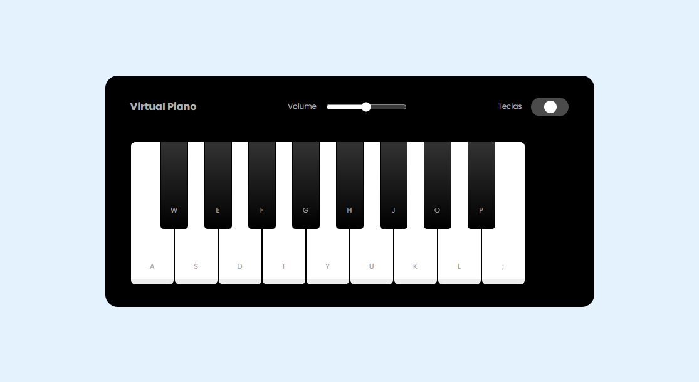

# Simulador de Piano

## Sobre o projeto
Trata de um simulador de piano, onde é possível tocá-lo utilizando o mouse e/ou o teclado da sua máquina.

## Tecnologias utilizadas
* HTML5 e CSS3 para a estrutura e aparência do jogo.
* JavaScript para a lógica de programação e interatividade.

## Funcionalidades
* **Tocabilidade**: É possível emitir o som das notas musicais por meio do clique do mouse (botão direito) e/ou ao pressionar uma determinada tecla do seu teclado com a letra referente a nota desejada.
* **Controle de volume**: É possível manipular o volume (aumentar/abaixar).
* **Exibir/ocultar letras**: Permite ocultar/exibir as letras referentes às notas gravadas nas teclas do instrumento.

## Como tocar o instrumento
1. Clone este repositório para sua máquina local.
1. Abra o arquivo `index.html` em seu navegador web.
1. Use o botão esquerdo do mouse OU as pressione as teclas com base nas letras que aparecem no instrumento - `recomendo utiizar o teclado da sua máquina`.

## Resultado obtido
